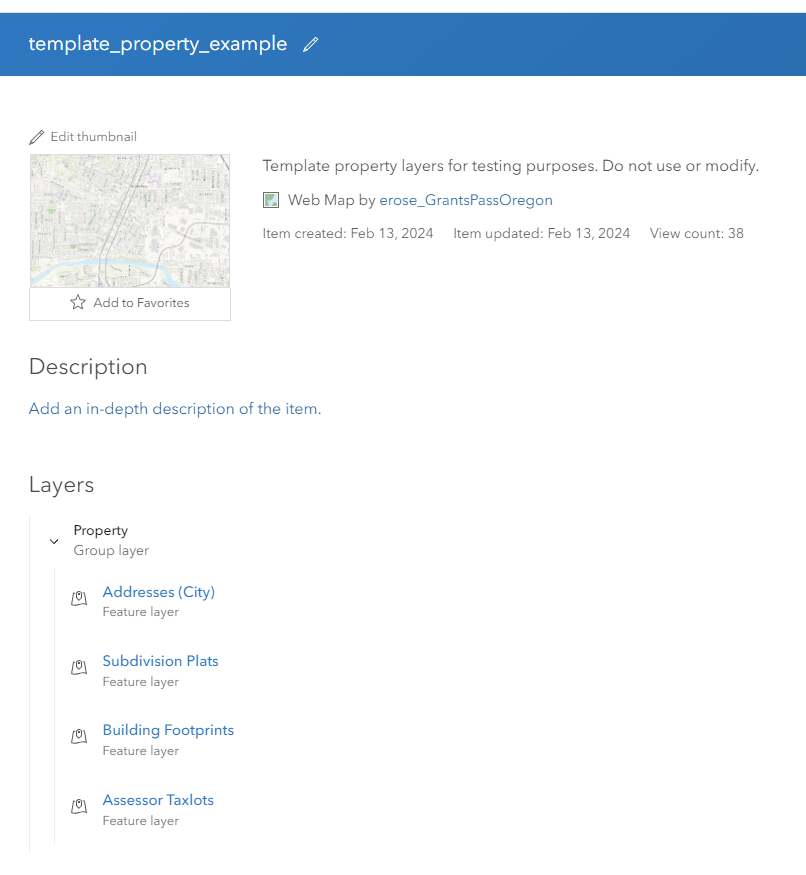
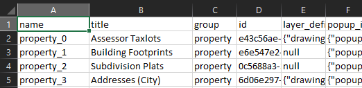
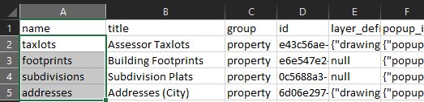

Template Creation and Use
============================

Any Webmap can serve as a template.  To use a Webmap as a template, you only need the item ID.  On the Overview page of AGOL or the internal portal, the item ID is in the *Details* section of *Item Information*, on the right side of the page.  The ID is also listed in the address string of the browser, following "id=".  Because an item ID is not a very memorable string of characters, we will assign a nickname to each ID.  First we create an empty dictionary, then add the desired templates using the nickname as a key and the item ID as the value.

.. code-block:: python

   # remember to import the mapmakers package
   import mapmakers as m

   templates = {}
   templates.update({"aerials": "553b8d97bbeb415c81e41bbb0649d66a"})
   templates.update({"boundaries": "c65bd751b50441cd9e07f9607f151b34"})
   templates.update({"plss": "f1e719ca11d248178d2d886654b38f44"})
   templates.update({"property": "c984c06eaf6f4869aab5ec3eaac999df"})

Here the *templates* variable defines an empty dictionary, and we add ids for four Webmaps.  These Webmaps are copies of templates that we use for current city services. The keys that you use will not appear on the final map product, they are human-readable nicknames intended to make your code easier to read and understand.

The *from_obj* Method
---------------------

The ``mapmakers`` package has a *Templates* class for managing template data.  We can create an instance of the *Templates* class from the dictionary of names and ids using the *from_obj* method in the *Templates* class.  The *from_obj* method is static, meaning that we must call it using the abstract class name.  The method takes a dictionary as the first argument, and it assumes that the dictionary is structured as above, using nicknames for keys and item IDs for values.  The second required argument is a reference to the authenticated GIS connection, which in the ``mapmakers`` package is named *GIS_CONN*.  You must run the :ref:`login script<login_script>` to create the *GIS_CONN* variable.

Continuing our example, we can instantiate a *Templates* object using the following command:

.. code-block:: python

   # here we alias GIS_CONN as gis
   gis = GIS_CONN
   # load templates from their item IDS
   tmp = m.Templates.from_obj(templates, gis)

While the templates are loading, a progress bar will appear and increment as each new template is loaded.  In this case, there are only four templates, but the web viewer requires more than a dozen, and the operation can take some time to complete, so we use the progress bar to indicate that the program is still working.

The *Templates* class has only a single property, *template*.  The *template* property contains a dictionary, using the same nicknames as keys that were specified in the *templates* variable we created earlier.  Instead of using item IDs as values, however, the *Templates* class has loaded all of the mapping information associated with the item ID, and it stores this information in a *Template* object.  A *Template* is another class unique to the ``mapmakers`` package.  Each *Template* object corresponds to a single Webmap, and the *Templates* object holds references to a number of *Template* objects.  Since the *template* field of *Templates* is a dictionary, we can check the contents using the *keys*, *values* or *items* methods.

.. code-block:: python

   tmp.template.keys()

Output:

.. code-block:: console

   dict_keys(['aerials', 'boundaries', 'plss', 'property'])

The *Template* class has the properties *name* and *id*, and these correspond to the nickname and item ID that we used to create the template above.  The *Template* class also has a field called *items*, and this contains another dictionary.  Each entry in the dictionary represents a layer on the target Webmap.  The value of the dictionary is a class called *TemplateItem*.  The *TemplateItem* class holds all information related to a specific layer, including properties for *title*, *group_name* (the template name), *item_name* (the layer name), *layer_definition*, *popup_info*, *url* and *search*.  We can select an individual template from a *Templates* object by including the dictionary key in brackets after the *template* field:

.. code-block:: python

   prop = tmp.template["property"]
   prop.items.keys()

Output:

.. code-block:: console

   dict_keys(['property_0', 'property_1', 'property_2', 'property_3'])

The *with_names* Method
-----------------------

From the output, we can infer that there are four layers on the "property" Webmap.  When creating a *Templates* instance using the *from_obj* method, the *item_name* of each *TemplateItem* is automatically assigned.  If you want to use more memorable or human readable names for each layer, there are a couple methods for doing this.  The first approach is to use the *with_names* method from the *Template* class.

The *with_names* method assumes that you know beforehand the number and order of layers in a template Webmap.  Since this is a method of the *Template* class, make sure that you are calling the method from a *Template* object.  Pass in as an argument a vector of names, with the requirement that the number of layers in the Webmap and the number of names in the vector must match.

.. code-block:: python

   prop = prop.with_names(["taxlots", "footprints", "subdivisions", "addresses"])
   prop.items.keys()

Output:

.. code-block:: console

   dict_keys(['taxlots', 'footprints', 'subdivisions', 'addresses'])

When reading layers from a Webmap on AGOL or our internal portal, the ordering is the inverse of its order on the Webmap.  This is an artifact of the how ESRI creates Webmaps, where the first layer assigned to a map goes to the bottom of the rendering stack, and subsequent layers go on top (as seen in the image below).  In a future update we may elect to reverse the ordering here, to match the "display order" in the map.  Let us know if this is a feature you would like to use.

   Order of layers in the "property" template on AGOL.

The *workbook* Method
---------------------

The second way to customize the names of individual layers on a map template is to use a workbook.  The *workbook* method allows you to save the relevant map information from a template onto a .csv file.  Within this .csv file, you can customize the layer names, and save your configuration for later use.  When reading template information from a .csv file, the ``mapmakers`` package does not need to re-open and read the reference templates on AGOL, so this method is faster than using *from_obj* for repeat build calls.  If you change the settings on one of your template maps on AGOL or our internal portal, you will still need to run the *from_obj* method to read in the new change.  Once these changes are exported to a workbook, you can load the map information directly from the workbook using the *from_workbook* method.

From *demo.py*:

.. code-block:: python

    def workbook():
        tmp = m.Templates.from_obj(templates, gis)
        logging.info("Templates: %s", len(tmp.template))
        tmp.workbook(gis, "examples/demo", True)
        logging.info("Workbook printed.")

We have wrapped all of the potential actions in *demo.py* within functions so that you can load the file into memory and experiment with different features of ``mapmakers`` by calling the functions defined in the demo from the interactive Python shell. The first line of the *workbook* function above is already familiar to you, and creates a *Templates* object from the dictionary of names and ids using the *from_obj* method.  The logging statement prints the number of templates read, in this case four.

The next line calls the *workbook* method.  Note that we call this method from the *Templates* object.  Because the *Templates* object holds four templates, the workbook will include information from all four Webmaps.  The first argument is the GIS connection (*GIS_CONN*), which we have aliased as *gis*.  The second argument is the file path for the workbook.  If you provide a valid file name with a proper file extension, such as "*my_file.csv*", then the workbook will receive this file name.  If you provide a directory, as in the example above, then the file will be called *workbook.csv* and located in the directory provided.  If the directory path is invalid, or the file name is invalid, the program will throw an error.  If the .csv file is open, perhaps because you were inspecting or editing it in Excel, the program will be unable to overwrite the .csv and will throw an error (I trigger this particular error often).

Note that exporting to *csv* is a "side-effect" that does not modify the *Templates* object, and does not have a return value, so we do not assign a new variable name to the result when we call the *workbook* method.

Alternative Workbook Approaches
^^^^^^^^^^^^^^^^^^^^^^^^^^^^^^^

Using the *workbook* method on a *Templates* object creates a single workbook that contains information from all the Webmap templates in the project.  The *workbook* method is also implemented for the *Template* class, with some minor differences.  In the *Template* class, ``mapmakers`` assumes you have already called *load* on the template, so the GIS connection is not required, just the file path or directory.  There are two optional arguments you can provide, *auto* and *named*.  If *auto=true*, ``mapmakers`` will automatically assign names to each layer (e.g. "property_0", "property_1", "property_2").  If *named=true*, ``mapmakers`` will preserve the names you have set for each layer using the *with_names* method.

.. code-block:: python

   prop.workbook("examples/demo", named=true)

The file name defaults to the nickname used as a key for the template, followed by the `.csv` extension, so in the above case the output file has the path "*examples/demo/property.csv*".

The *Templates* class also provides the *workbooks* method, which is a wrapper around the *workbook* method from the *Template* class.  The *workbooks* method iterates through each template in the *template* property field, and calls *workbook* on it, emitting a different .csv file for each template.  The name of each template will correspond to the nickname used as the key for the template.  In the case of this example, calling *workbooks* would produce four .csv files in the "*examples/demo*" directly, namely "*aerials.csv*", "*boundaries.csv*", "*plss.csv*" and "*property.csv*".

As with the *workbook* method for this class, *workbooks* takes a GIS connection as the first argument.  It also takes an optional argument, *auto*, which defualts to *false*.  If *auto=true*, the *workbooks* method will automatically assign names to layers.

.. code-block:: python

   tmp.workbooks(gis, auto=true)

These methods provide alternatives that may integrate better with your workflow.  For most use cases, the *workbook* method in the *Templates* class is the recommended approach to create a workbook for your project.

Inspecting and Modifying Workbooks
^^^^^^^^^^^^^^^^^^^^^^^^^^^^^^^^^^

The easiest way to inspect and modify a .csv file is to open it in Excel.  The workbook includes seven columns: *name*, *title*, *group*, *id*, *layer_definition*, *popup_info*, *url* and *search*.

.. csv-table:: *workbook.csv*
   :header: "column", "description"

   "*name*", "human-readable nickname for the layer"
   "*title*", "display title for the layer"
   "*group*", "human-readable nickname for the template"
   "*id*", "Internal program ID for the layer"
   "*layer_definition*", "JSON dictionary containing the layer definition"
   "*popup_info*", "JSON dictionary containing the popup info"
   "*url*", "URL path for the layer source"
   "*search*", "Searchable fields within the layer"

If you are using *auto-naming*, inspecting the workbook can be an easy way to determine the specific name of a layer of interest, using the *title* column to identify the layer.

From *property.csv*:

   The *title* field can help to determine the layer associated with a row of data on the worksheet.

.. raw:: html

   
<b>The <i>name</i> and <i>title</i> fields are safe for you to modify</b>.

You can assign new nicknames to make the layers easier to reference and use in your code, and you can change the display title here as well.  None of the other columns are safe to edit, with the possible exception of the *search* field.  **Do not** modify the *group*, *id*, *layer_definition*, *popup_info* or *url* from within the .csv file.  If you change the *group* or *id*, the program will not be able to associate the row data correctly with its parent template, and you will not be able to make references to it properly.

The *layer_definition* and *popup_info* are JSON dictionaries copied directly from AGOL, and should not be modified manually because the specifications for what fields and values they can include is very strict and the changes you submit may not be valid.  If you want to change the layer definition or popup info associated with the template, then open the template webmap in AGOL or our internal portal, and modify the Webmap using their GUI interface normally.  When you have saved the results, load the template into ``mapmakers`` again and export it to a workbook.  You should then see the changes to the template reflected in updated JSON entries in the *layer_definition* and *popup_info* columns.

The *url* field specifies the source path for the layer data in the template.  This is not necessarily the same as the url you want to use as the source for your new map.  We record this field as a convenience, so that if you want to create a new layer from the template using the same url as the template map, you can.  When you create a new map Item from a template, you can choose whether to provide a new url or use the one referenced in the template.  For the city web viewer, we can publish the map from services hosted on AGOL, or on our internal portal.  For a given layer, we can use the same template regardless of whether we are pulling the service from our internal portal or AGOL.

The primary intended use of the workbook for editing is to change the nickname associated with the layer, set in the *name* field, for easier reference and use in your own code:

*property.csv*

   Changing the layers names for use in your own code.

The *from_workbook* Method
--------------------------

If you create the *Templates* instance using the *from_obj* method, and do not make any changes to the names or titles in the workbook, then you are ready to begin creating a new map using the *Templates* object.  If you have made changes to the names or titles using the workbook, then you will need to read these changes back into the ``mapmakers`` project using the *from_workbook* method.  If you have stored template information previously into a workbook, you can also use the *from_workbook* method to read the workbook into your project instead of loading the template information from AGOL or the internal portal using the *from_obj* method, for a slight speed boost in loading time.

The *from_workbook* method takes the path to the workbook as an argument.  If the file path does not exist, the program will throw an error.  In our *demo.py* examples, we have defined a *load* function as follows:

.. code-block:: python

    def load():
        return m.Templates.from_workbook("examples/demo/workbook.csv")

We can create a new *Templates* instance by assigning a variable name to the output of the function like so:

.. code-block:: python

   tmp = load()

To provide flexibility, we have also implemented the *from_workbook* method for the *Template* class.  The different between the two methods is their return types, which matches the class it is called from:  *Templates.from_workbook* returns an instance of the *Templates* class, and *Template.from_workbook* returns an instance of the *Template* class.  If you use the *workbooks* method to make a separate .csv file for each template, then use *Template.from_workbook* to read each workbook back into a *Template* in your project.

If you accidentally read a workbook with multiple templates into a *Template* class, the operation will still succeed and return a valid *Template* object.  You can still select an individual layer by passing the key name into the *items* property, but you will not be able to reference different template key names, because all the information has been merged into a single template.  It is not recommended to use this approach, instead use *Templates.from_workbook* if reading a workbook containing multiple templates, and use *Template.from_workbook* for a workbook containing a single template.

Here is a breakdown of the different template classes in ``mapmakers``:

.. csv-table:: Template Classes in `mapmakers`
   :header: "Class", "Description", "*from_obj*", "*workbook*", "*workbooks*", "*from_workbook*", "*with_names*"

   "*Templates*", "Multiple reference templates", "✓", "✓", "✓", "✓", "X"
   "*Template*", "A single reference template", "X", "✓", "X", "✓", "✓"
   "*TemplateItem*", "A single layer from a template webmap", "X", "X", "X", "X", "X"

The package includes multiple ways to create and load templates in order to accommodate different preferences in workflow.  When I began, I thought that using a single workbook would be unwieldy because of the large number of layers in use by the city.  I also thought that assigning memorable nicknames to individual layers would be an important part of my personal workflow.  Now that I am able to experiment with using the package, I find that I almost never use individual template workbooks or the *with_names* method.  I prefer loading all the template information into a single workbook using *Templates.from_workbook*, and then looking up the auto-generated layer name in the .csv file when I need to pull out an individual layer. We have tried to provide some flexibility, so you can use whatever approach that works best for you.
